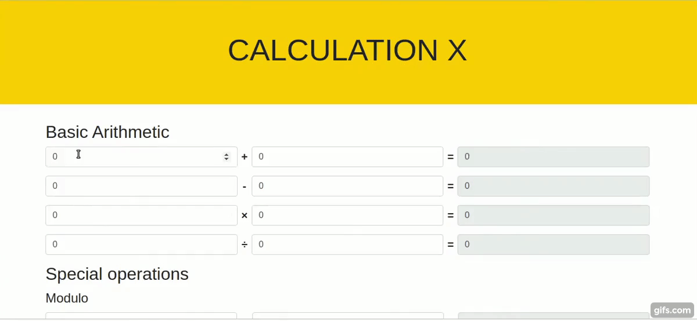

# Create a Calculator

## Description

An HTML page for a basic calculator with features of addition, subtraction, multiplication, division and the special modulo operation is given in the repo. Your goal is to make it work using Javascript!

## Instructions

- Do not modify the `index.html` file
- Work in the `js/index.js` file provided

### Task 1

- Create a Javascript function which calculates the result of two numbers depending on whether the numbers are being added, subtracted, multiplied or divided.

### Task 2

- Display the result of the calculation to the user (in the result field) as the user types in the input field.

> Hint: Refer to the representation below for an idea of what your result should look like.

[//]: # (autograding info start)
#  Results
> ⌛ Give it a minute. As long as you see the orange dot  on top, CodeBuddy is still processing. Refresh this page to see it's current status.
>
> This is what CodeBuddy found when running your code. It is to show you what you have achieved and to give you hints on how to complete the exercise.

### Browser-Calculator

|                 Status                  | Check                                                                                    |
| :-------------------------------------: | :--------------------------------------------------------------------------------------- |
|  | Should add given numbers and display the result |
|  | Should subtract given numbers and display the result |
|  | Should multiply given numbers and display the result |
|  | Should divide given numbers and display the result |
|  | Should return the remainder of the  given numbers and display the result |

[🔬 Results Details](../../actions)
[🐞 Tips on Debugging](https://github.com/DCI-EdTech/autograding-setup/wiki/How-to-work-with-CodeBuddy)
[📢 Report Problem](https://docs.google.com/forms/d/e/1FAIpQLSfS8wPh6bCMTLF2wmjiE5_UhPiOEnubEwwPLN_M8zTCjx5qbg/viewform?usp=pp_url&entry.652569746=Browser-Calculator)

[//]: # (autograding info end)