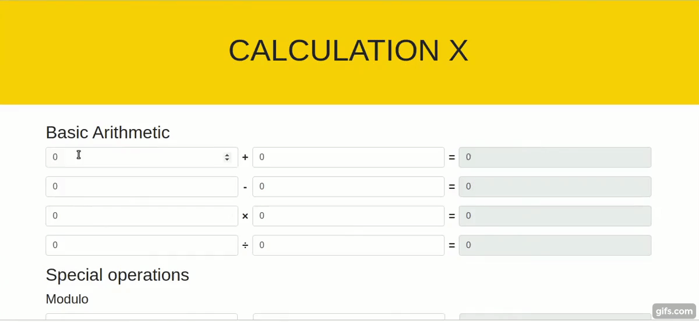

# Einen Rechner erstellen

## Beschreibung

Eine HTML-Seite für einen einfachen Taschenrechner mit den Funktionen Addition, Subtraktion, Multiplikation, Division und der speziellen Modulo-Operation ist im Repo enthalten. Dein Ziel ist es, sie mit Javascript zum Laufen zu bringen!

## Anweisungen

- Verändere die Datei `index.html` nicht
- Arbeite in der bereitgestellten Datei `js/index.js`.

## Aufgabe 1

- Erstelle eine Javascript-Funktion, die das Ergebnis von zwei Zahlen berechnet, je nachdem, ob die Zahlen addiert, subtrahiert, multipliziert oder dividiert werden.

### Aufgabe 2

- Zeige dem Benutzer das Ergebnis der Berechnung (im Ergebnisfeld) an, während der Benutzer in das Eingabefeld tippt.

> Tipp: In der folgenden Abbildung siehst du, wie dein Ergebnis aussehen sollte.

